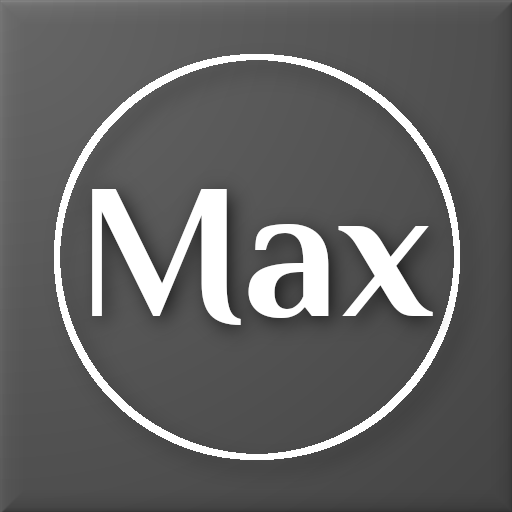
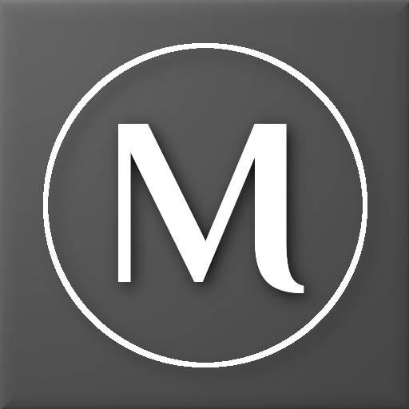
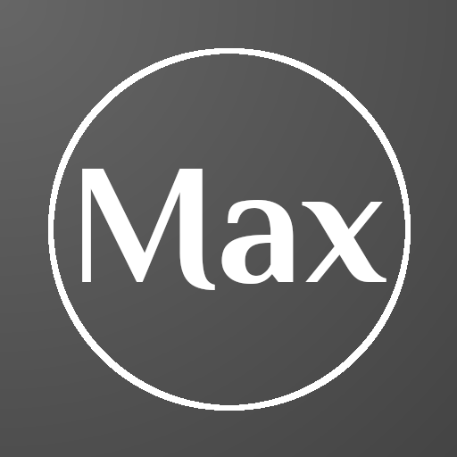
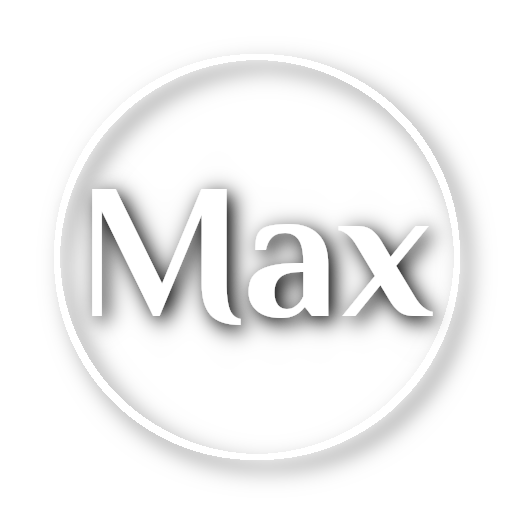
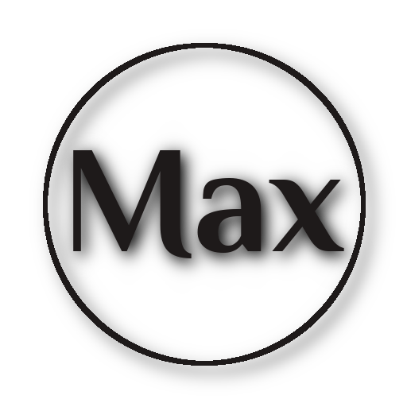
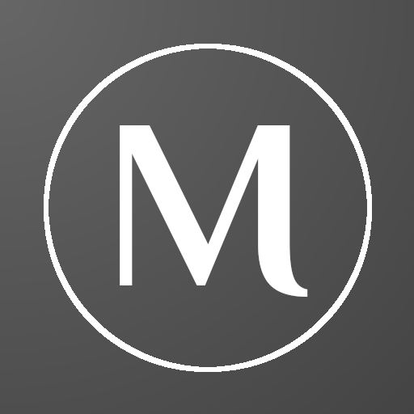
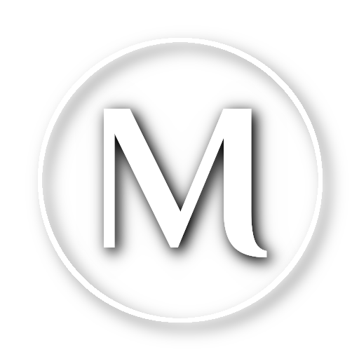
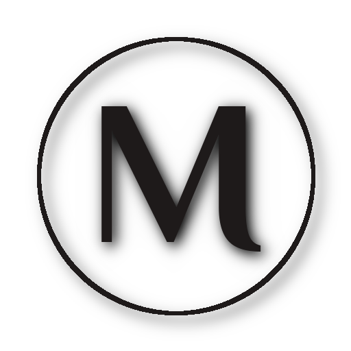

 

# Max Logos

The Max project logo continues the look of the RuthAndRoth project logo with both
'Max' and 'M' in a circle.  The typeface is a bit simpler to reduce the amount of
degradation when scaling the logo smaller.

The source in Gimp XCF format and a basic set of variants are included here
for easy use.

## Usage

The 'Max' and 'M' logos are used to indicate projects or products that are either
based on or compatible with the Max project mesh bodies.  The Max project has
chosen to use the grey background for its branding, other creators are free to
adapt the coloring to their own needs.

### OSGrid

A box containing full-perm textures of the logo is available in the
[RuthAndRoth sim](hop://login.osgrid.org/RuthAndRoth/153/109/21)
at hop://login.osgrid.org/RuthAndRoth/153/109/21.

### Second Life

A box containing full-perm textures of the logo is available at
[Serie-ous Style](http://maps.secondlife.com/secondlife/Fireheart/240/219/21).

## Construction Details

The logo uses the [Philosopher](https://fonts.google.com/specimen/Philosopher)
typeface designed by Jovanny Lemonad. It is available under the
[Open Font License](http://scripts.sil.org/cms/scripts/page.php?site_id=nrsi&id=OFL_web)
at a number of font download sites, including
[Google Fonts](https://fonts.google.com/specimen/Philosopher).

The logo is drawn as follows:

* The circle is 80% of the 512x512 image size and centered
* The 'Max' is at 46 pt (37.5% of the image size), is centered horizontally and is
  15 px below center vertically
* The 'M' is at 72 pt (58.5% of the image size), is centered vertically and is
  33 px right of center horizontally
* A 10x10 px drop-shadow to lower-right is applied in black at 50%
  opacity to the circle, 'M' and 'Max' text
* The background uses a partial radial gradient in grey (#666666 -
  #444444) with the light side centered on the upper-left corner to
  match the drop-shadow
* A 25 px bevel is applied to the background

## Images

The pre-exported logo images are named following this pattern:

    max-logo-<foreground-color>-<background-color>-<extra>.png

where `<extra>` is anything needed to distinguish additional characteristics
such as `flat` (without drop shadows).

   
   

* max-logo-white-grey-512.png - The default version with bevel and shadows
* max-logo-white-grey-flat-512.png - A flat version without the background bevel
  or drop shadows
* max-logo-white-alpha-512.png - Suitable for tinting in-world to put over
  any background
* max-logo-black-alpha-512.png - Suitable for placing over any light background
* m-logo-white-grey-512.png - The default version with bevel and shadows
* m-logo-white-grey-flat-512.png - A flat version without the background bevel
  or drop shadows
* m-logo-white-alpha-512.png - Suitable for tinting in-world to put over
  any background
* m-logo-black-alpha-512.png - Suitable for placing over any light background
